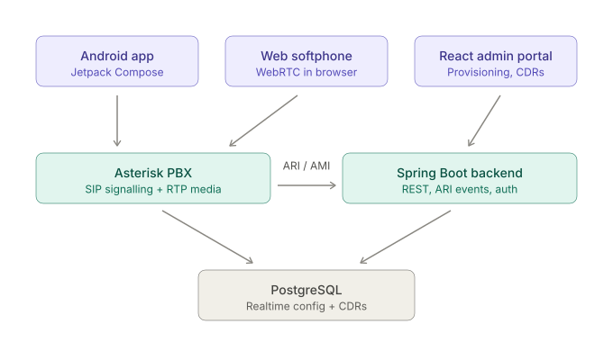

# VoIP Platform

A self-hosted VoIP/SIP telephony stack, built from the ground up as an
end-to-end engineering exercise: signalling, media, provisioning, and
clients — not a wrapper around a third-party calling API.

> **Status:** in active development. See the roadmap below for what runs today.

---
## What this is

Most "VoIP projects" call out to Twilio or Vonage and stop there. This one
implements the actual telephony layer: a SIP registrar and B2BUA handling
call signalling and RTP media, a control plane that provisions it, and
native clients that register against it.

## Architecture

<p align="center">
  
</p>


Asterisk is a B2BUA — it terminates both call legs and bridges them, which is
what makes IVR, recording, and transcoding possible. A SIP proxy such as
Kamailio sits in front of it at the edge (see roadmap).

## Stack

| Layer | Technology |
|---|---|
| SIP / media | Asterisk 22 LTS (compiled from source, chan_pjsip), RTP |
| Control plane | Java, Spring Boot, Asterisk REST Interface (ARI) |
| Data | PostgreSQL (Asterisk Realtime + CDR store) |
| Admin portal | React, TypeScript |
| Mobile client | Android, Kotlin, Jetpack Compose |
| Infrastructure | Docker Compose |

## Roadmap

- [ ] Asterisk containerised, two extensions registering and calling
- [ ] Dialplan: IVR, voicemail, music on hold, call recording
- [ ] Endpoint configuration migrated to PostgreSQL (Asterisk Realtime)
- [ ] Spring Boot control plane: REST provisioning, ARI event stream, JWT auth
- [ ] React admin portal: extension CRUD, live call monitor, CDR dashboard
- [ ] Android softphone: registration, in/outbound calls, call UI
- [ ] Browser softphone over WebRTC (WSS + coturn)
- [ ] Hardening: TLS/SRTP, Kamailio edge proxy, Prometheus + Grafana, CI

## Running locally

Requires Docker Engine 29+ and Compose v5+.

```bash
git clone https://github.com/<you>/voip-platform.git
cd voip-platform/infra
docker compose up --build
```

Full setup, including softphone configuration, is in [`docs/`](docs/).

## Notes on SIP and NAT

Containers run with `network_mode: host`. SIP carries IP addresses inside
the SDP body, so Docker's NAT rewrites the packet headers but not the
payload — the result is signalling that succeeds and audio that silently
goes nowhere. Host networking avoids this on Linux; the production answer
is STUN/TURN, covered in the hardening phase.

## Licence

MIT